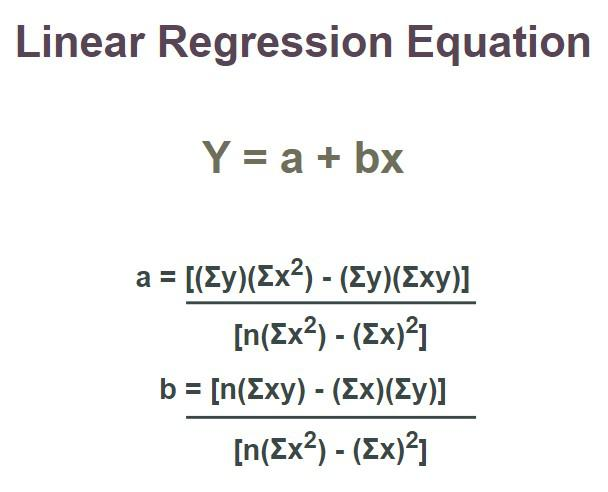

# Linear-stats

The exercise requires you to create a program that reads numerical data from a file, calculates the linear regression line and the Pearson correlation coefficient, and prints the results in a specified format. The x-values are determined by the line numbers, while the y-values are the actual numbers in the file. The program should format the outputs to six decimal places for the regression line coefficients and ten decimal places for the correlation coefficient.

## Author

- **Hamza Elkhawlani** [GitHub Profile](https://github.com/heeemzaaa)

## Usage

### Instalation
1. Clone the repository:
   ```bash
    git clone https://github.com/heeemzaaa/linear-stats.git
2. Navigate to the project directory:
    ```bash
    cd  linear-stats
### how to use

1. Download the required folder from the intra:

2. Extract the folder:

3. Copy the executable file ./linear-stats to your repository: 

4. Run the executable file:
    ```bash
    ./linear-stats
5. Run your Program:
    ```bash
    go run main.go <filename.txt>
6. See if the result produced by the program is the same as the executable file that you copied:


## Equations Formula

1. This is the formula of the Linear Regression Line:
    
    
     

2. This is the formula of the Pearson Correlation Coefficient:
   
   
    


## Implementation details

### Linear Regression Line
    first of all we tried to calculate a and b to pss them to the main formula.
    After that we calculated the Linear Regression Line.

### Pearson Correlation Coefficient 
    I calculated each line then I passed the values to the main operation.


